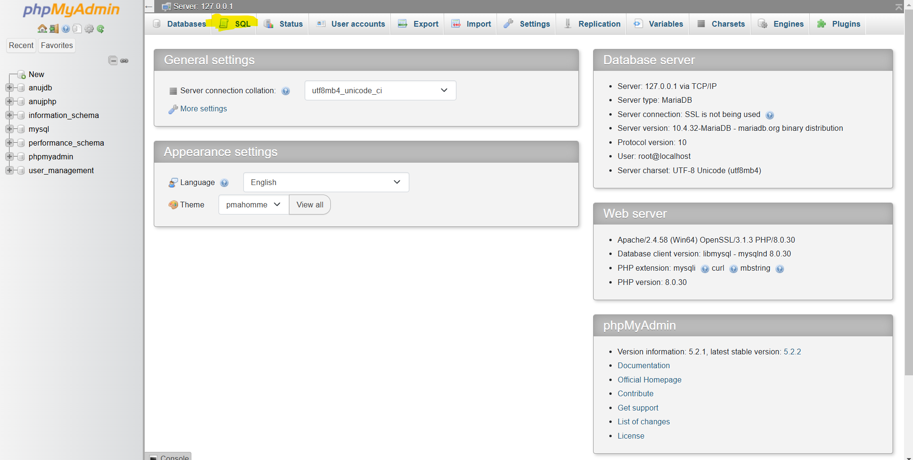

# PHP Project

## Clone this project
To clone this repository, use the following command:

```bash
git clone https://github.com/anujkattel/phphw.git
```
# Installation
## 1. Navigate into the project directory:
```
cd phphw
```
## 2. Start your server using xampp:
turn on apache and sql server

## 3. GO TO BROWSER
```
http://localhost/phpmyadmin
```
## 3. GO TO SQL AREA


```
CREATE DATABASE IF NOT EXISTS anujphp;
USE anujphp;

CREATE TABLE IF NOT EXISTS regn (
    ID INT PRIMARY KEY AUTO_INCREMENT,
    name VARCHAR(100) NOT NULL,
    email VARCHAR(100) NOT NULL UNIQUE,   
    phone VARCHAR(15) NOT NULL, 
    address VARCHAR(255) NOT NULL,      
    city VARCHAR(100) NOT NULL,
    state VARCHAR(100) NOT NULL,
    created_at TIMESTAMP DEFAULT CURRENT_TIMESTAMP 
);

create table signup(
    id int primary key auto_increment,
    name varchar(100) not null,
    email varchar(100) not null,
    phone varchar(100) not null,
    password varchar(100) not null,
    created_at timestamp default current_timestamp
);
```
## Paste above command
